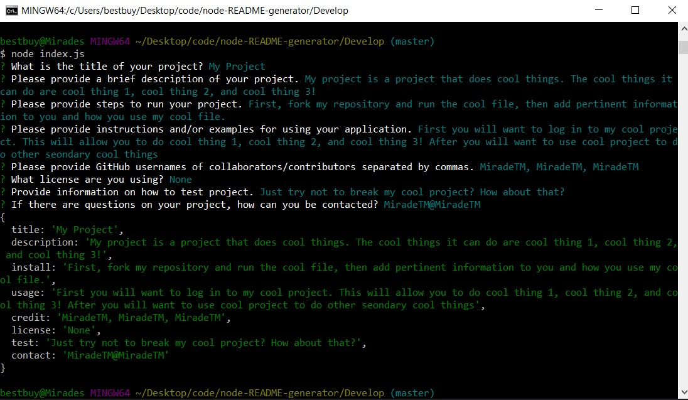

# Node README generator
## Created by MiradeTM
### located at [github](https://github.com/MiradeTM/node-README-generator)

This project takes user input via terminal or bash and uses node to create a readme file based off of the user input.

to use this one only needs to run a 'node index.js' and answer the following prompts.

[sample readme](./utils/SampREADME.md)